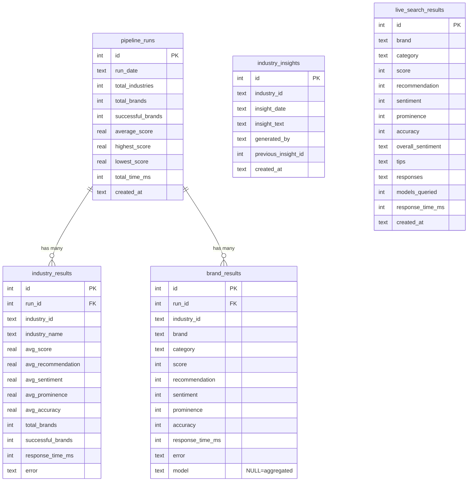
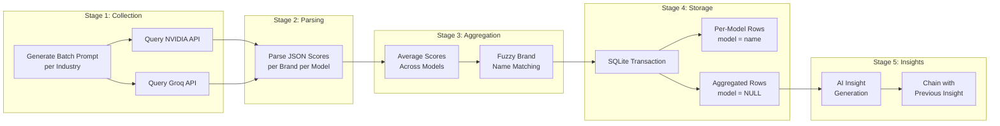

# Architecture — rAsh Score

> AI Brand Intelligence Platform for the Indian Market

## System Overview

**rAsh Score** measures how AI language models perceive and recommend brands. It queries multiple AI models (NVIDIA Nemotron, Groq/Llama, GPT-OSS) with standardized prompts and computes a composite 0-100 visibility score across four dimensions: Recommendation, Sentiment, Prominence, and Accuracy.

The platform tracks **285 brands across 19 Indian industries** with daily automated scoring via GitHub Actions, serving results through a Next.js web application deployed on Vercel.

---

## High-Level Architecture

```mermaid
graph TB
    subgraph "Daily Pipeline (GitHub Actions)"
        CRON[⏰ Cron: 01:30 UTC] --> PIPELINE[run-pipeline.ts]
        PIPELINE --> NVIDIA[NVIDIA Nemotron API]
        PIPELINE --> GROQ[Groq API<br/>Llama / GPT-OSS / Gemma]
        NVIDIA --> AGGREGATE[Score Aggregation]
        GROQ --> AGGREGATE
        AGGREGATE --> DB[(brand-intelligence.db<br/>SQLite)]
        DB --> COMMIT[Git Commit + Push]
    end

    subgraph "Insights Pipeline (GitHub Actions)"
        CRON2[⏰ Cron: 03:00 UTC] --> INSIGHTS[run-insights.ts]
        INSIGHTS --> GROQ2[Groq / NVIDIA API]
        GROQ2 --> DB
    end

    subgraph "Web Application (Vercel)"
        VERCEL[Next.js 16<br/>sql.js WASM] --> API_BRANDS[/api/brands]
        VERCEL --> API_INTEL[/api/intelligence]
        VERCEL --> API_CHECK[/api/check-brand]
        VERCEL --> API_COMPARE[/api/compare-brands]
        VERCEL --> DASHBOARD[Dashboard UI]
        VERCEL --> INTELLIGENCE[Intelligence UI]
        VERCEL --> BRAND_DETAIL[Brand Detail Pages]
    end

    COMMIT --> VERCEL
    DB -.->|Read via sql.js| VERCEL

    USER((User)) --> DASHBOARD
    USER --> INTELLIGENCE
    USER --> BRAND_DETAIL
```

---

## Database Schema



---

## Pipeline Architecture



---

## Tech Stack

| Layer | Technology | Rationale |
|-------|-----------|-----------|
| **Frontend** | Next.js 16, React 18, TypeScript | Modern SSR/ISR framework with excellent DX |
| **Styling** | Tailwind CSS 3.4 | Utility-first for rapid dark theme development |
| **Animation** | Framer Motion | Smooth transitions for cards and sections |
| **Charts** | Custom SVG | Zero dependencies, full control, demonstrates engineering depth |
| **Database** | SQLite (sql.js WASM + better-sqlite3) | Portable, serverless-compatible, committed to git |
| **AI Models** | NVIDIA Nemotron, Groq (Llama, GPT-OSS) | Multi-model analysis for bias detection |
| **CI/CD** | GitHub Actions | Free, reliable, auto-commits pipeline results |
| **Hosting** | Vercel | Zero-config Next.js deployment with ISR |
| **Validation** | Zod | Runtime type safety for API inputs |

### Dual Database Strategy

The project intentionally uses two SQLite libraries:

- **`better-sqlite3`** (Node.js native) — Used by pipeline scripts (`run-pipeline.ts`, `run-insights.ts`) that run in GitHub Actions. Synchronous API, fast writes, WAL mode support.
- **`sql.js`** (WASM) — Used by API routes on Vercel. Works in serverless environments where native modules aren't available. Reads the `.db` file from the filesystem.

---

## Deployment Topology

```
GitHub Repository (kprsnt2/BrandScore)
├── Source code (src/, scripts/, etc.)
├── data/brand-intelligence.db  ← Pipeline output committed here
└── .github/workflows/
    ├── daily-pipeline.yml  (01:30 UTC)
    └── daily-insights.yml  (03:00 UTC)

        ↓ Auto-deploy on push

Vercel (brandscore.kprsnt.in)
├── Next.js SSR/ISR
├── API Routes (read-only DB access via sql.js)
└── Static assets (CSS, fonts, images)
```

---

## API Endpoints

| Endpoint | Method | Description |
|----------|--------|-------------|
| `/api/brands` | GET | Industry brand rankings with score/rank deltas |
| `/api/brands/search` | GET | Brand search across all industries |
| `/api/brands/timeline` | GET | Historical score data for chart |
| `/api/brands/insights` | GET | AI-generated daily insights |
| `/api/brands/metadata` | GET | Industry metadata |
| `/api/intelligence` | GET | Cross-industry analytics, model bias, correlations |
| `/api/check-brand` | POST | Live brand analysis via AI |
| `/api/compare-brands` | POST | Head-to-head brand comparison |
| `/api/health` | GET | System health check |

---

## Author

Built by [Prashanth Kumar Kadasi](https://kprsnt.in) — combining AI Engineering, Data Engineering, and PMP methodology.
